# EKS-task
# Deploying ownCloud On Amazon EKS using EFS as a storage:-
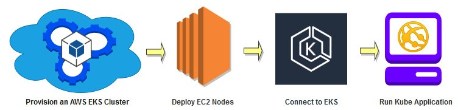

## Amazon Elastic Kubernetes Service :-
Amazon Elastic Kubernetes Service (Amazon EKS) is a fully managed Kubernetes service. Customers such as Intel, Snap, Intuit, GoDaddy, and Autodesk trust EKS to run their most sensitive and mission critical applications because of its security, reliability, and scalability.
AWS makes it easy to run Kubernetes in the cloud with scalable and highly-available virtual machine infrastructure, community-backed service integrations, and Amazon Elastic Kubernetes Service (EKS), a certified conformant, managed Kubernetes service.

## Amazon Elastic File System :-
Amazon Elastic File System (Amazon EFS) provides a simple, scalable, fully managed elastic NFS file system for use with AWS Cloud services and on-premises resources. It is built to scale on demand to petabytes without disrupting applications, growing and shrinking automatically as you add and remove files, eliminating the need to provision and manage capacity to accommodate growth.

## ownCloud:-
ownCloud is a suite of client–server software for creating and using file hosting services. ownCloud functionally has similarities to the widely used Dropbox. The primary functional difference between ownCloud and Dropbox is that ownCloud does not offer data centre capacity to host stored files. The Server Edition of ownCloud is free and open-source, thereby allowing anyone to install and operate it without charge on their own private server.

## Some Pre-requisites:-
1. AWS account
2. AWS CLI
3. eksctl
4. kubectl

# Implementation:-

First of all we create a Kubernetes cluster on AWS using EKS. There are three ways to do that but, we’ll be using the CLI option. 
You’ll need an IAM user with Administrator Access or the root user.
We need to configure the AWS by using AWS CLI, for this open the command prompt in windows and run the following command.

``` html 
aws confiure
```
Use this command and enter the user details along with the region id to login to AWS using CLI.

## 1. Creating the EKS cluster:-

 Now, we create a yml file for creating EKS cluster
 
 ``` html 
* cluster.yml

apiVersion: eksctl.io/v1alpha5
kind: ClusterConfig

metadata:
  name: sccluster
  region: ap-south-1

nodeGroups:
   - name: node1
     desiredCapacity: 2
     instanceType: t2.micro
     ssh:
        publicKeyName: mykey

   - name: node-mixed
     minSize: 1
     maxSize: 3
     instancesDistribution:
       maxPrice: 0.017
       instanceTypes: ["t2.micro"] 
       onDemandBaseCapacity: 0
       onDemandPercentageAboveBaseCapacity: 50
       spotInstancePools: 2     
     ssh:
         publicKeyName: mykey
```

To start creating the cluster, execute the cluster.yml file.

``` html 
eksctl create cluster -f cluster.yml
```
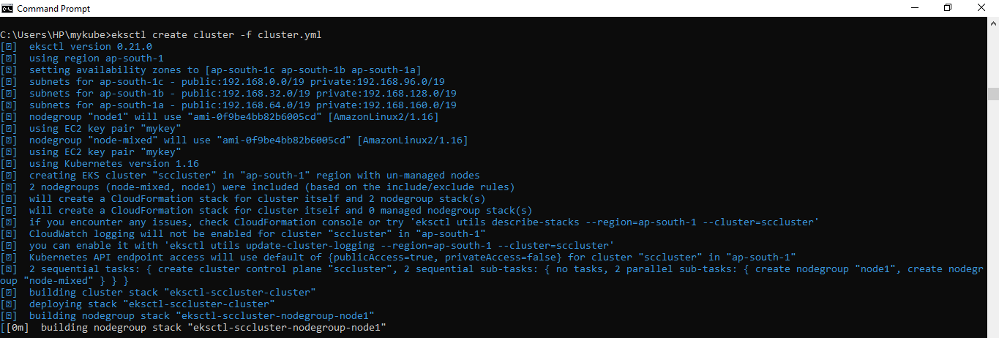

You can see Instances and Spot Instance Created behind the scene.

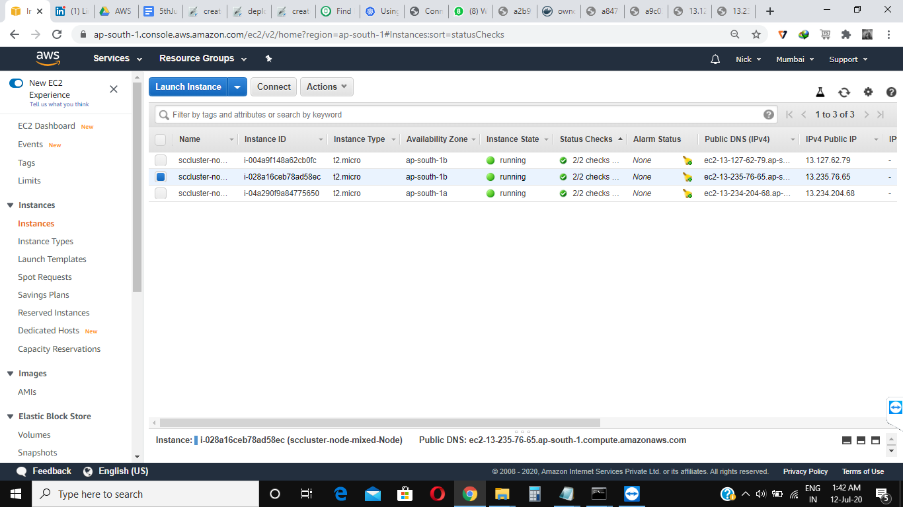
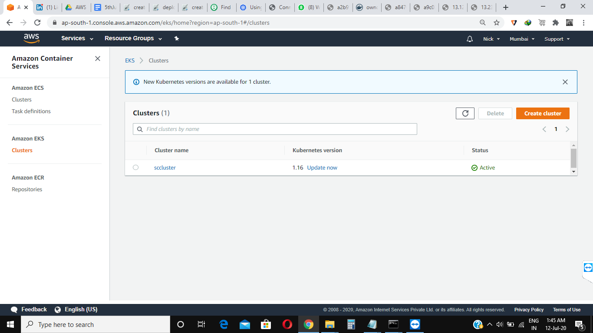
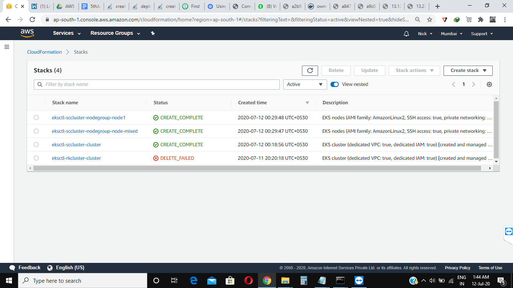

## 2. Now that the cluster is launched, update the kubeconfig file:-
``` html 
aws eks update-kubeconfig --name sccluster
```
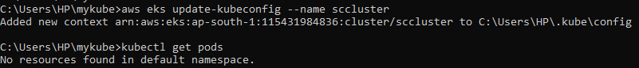

View your Kubernetes config file using

``` html 
kubectl config view
```

## 3: Create the new namespace as it is used to keep our work in different room and easy to maintain:-

``` html 
kubectl create ns scns
```
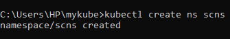

Update the default namespace.

``` html 
kubectl config set-context --current --namespace=scns
```
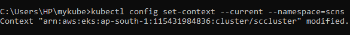

## 4. Now we have to create the EFS instead of EBS storage:-
- This can be done manually by going to AWS or we can use the terraform to create the EFS, here creating manually.
- Important thing while creating, we have to create in the same VPC and in same subnets in which nodes are running so simply go and check the EC2 instances then select the desired one then create.

## 5. Now create the EFS provisioner as EFS use the provisioner:-

``` html 
* efs-provisioner.yml

kind: Deployment
apiVersion: apps/v1
metadata:
  name: efs-provisioner
spec:
  selector:
    matchLabels:
      app: efs-provisioner
  replicas: 1
  strategy:
    type: Recreate
  template:
    metadata:
      labels:
        app: efs-provisioner
    spec:
      containers:
        - name: efs-provisioner
          image: quay.io/external_storage/efs-provisioner:v0.1.0
          env:
            - name: FILE_SYSTEM_ID
              value: fs-e078f231
            - name: AWS_REGION
              value: ap-south-1
            - name: PROVISIONER_NAME
              value: cloud/aws-efs
          volumeMounts:
            - name: pv-volume
              mountPath: /persistentvolumes
      volumes:
        - name: pv-volume
          nfs:
            server: fs-e078f231.efs.ap-south-1.amazonaws.com
            path: /
```
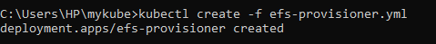

## 6. Now create the nfs-provisioner-role-binding:-

``` html 
* rbac.yml

apiVersion: rbac.authorization.k8s.io/v1beta1
kind: ClusterRoleBinding
metadata:
  name: nfs-provisioner-role-binding
subjects:
  - kind: ServiceAccount
    name: default
    namespace: scns
roleRef:
  kind: ClusterRole
  name: cluster-admin
  apiGroup: rbac.authorization.k8s.io

```
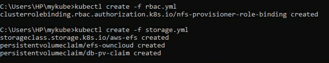

## 7. In this step we have created the storage class and 2 pvc one for ownCloud and One for MySQL:-

``` html

* storage.yml

kind: StorageClass
apiVersion: storage.k8s.io/v1
metadata:
  name: aws-efs
provisioner: cloud/aws-efs
---
kind: PersistentVolumeClaim
apiVersion: v1
metadata:
  name: efs-owncloud
  annotations:
    volume.beta.kubernetes.io/storage-class: "aws-efs"
spec:
  accessModes:
    - ReadWriteMany
  resources:
    requests:
      storage: 10Gi
---
kind: PersistentVolumeClaim
apiVersion: v1
metadata:
  name: db-pv-claim
  annotations:
    volume.beta.kubernetes.io/storage-class: "aws-efs"
spec:
  accessModes:
    - ReadWriteMany
  resources:
    requests:
      storage: 10Gi

```

To start creating the storage, execute the storage.yml file.

``` html
kubectl create -f storage.yml
```

## 8. Here, we Deployed owncloud with mysql database and because of privacy i have created a secret file

``` html
kubectl create secret generic mysql-pass --from-literal=password=redhat

kubectl create secret generic sqlroot-password --from-literal=root-pass=redhat
```
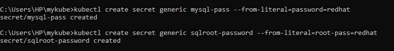

## - Now run the db.yml file to create the sql pods and it will create in one of the nodes or cluster of kubernetes

``` html
* db.yml

apiVersion: v1
kind: Service
metadata:
  name: clouddb
  labels:
    app: cf
spec:
  ports:
  - port: 3306
  selector:
    app: cf
  clusterIP: None
---
apiVersion: apps/v1
kind: Deployment
metadata:
  name: mydb
  labels:
    app: cf
spec:
  selector:
   matchLabels:
     app: cf
  strategy:
    type: Recreate
  template:
    metadata:
      labels:
        app: cf
    spec:
       containers:
       - image: mysql:5.6
         name: mysql
         env:
         - name: MYSQL_ROOT_PASSWORD
           valueFrom:
             secretKeyRef:
              name: sqlroot-password
              key: root-pass
         - name: MYSQL_USER
           value: redhat
         - name: MYSQL_PASSWORD
           valueFrom:
             secretKeyRef:
               name: mysql-pass
               key: password
         - name: MYSQL_DATABASE
           value: mydb
         ports:
         - containerPort: 3306
           name: mysql
         volumeMounts:
         - name: mysql-ps
           mountPath: /var/lib/mysql
       volumes:
       - name: mysql-ps
         persistentVolumeClaim:
           claimName: db-pv-claim
           
```

 Then, execute the db.yml file
 
 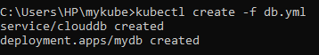
 
## - Deployment of ownCloud

``` html
* owncloud.yml

apiVersion: v1
kind: Service
metadata:
  name: owncloud
  labels:
    app: cf
spec:
  ports:
    - port: 80
  selector:
    app: cf
    tier: frontend
  type: LoadBalancer
---
apiVersion: apps/v1 # for versions before 1.9.0 use apps/v1beta2
kind: Deployment
metadata:
  name: owncloud
  labels:
    app: cf
spec:
  selector:
    matchLabels:
      app: cf
      tier: frontend
  strategy:
    type: Recreate
  template:
    metadata:
      labels:
        app: cf
        tier: frontend
    spec:
      containers:
      - image: owncloud
        name: owncloud
        env:
        - name: MYSQL_ROOT_PASSWORD
          valueFrom:
            secretKeyRef:
             name: sqlroot-password
             key: root-pass
        - name: MYSQL_USER
          value: redhat
        - name: MYSQL_PASSWORD
          valueFrom:
            secretKeyRef:
              name: mysql-pass
              key: password
        - name: MYSQL_DATABASE
          value: mydb
        ports:
        - containerPort: 80
          name: owncloud
        volumeMounts:
        - name: owncloud-persistent-storage
          mountPath: /var/www/html
      volumes:
      - name: owncloud-persistent-storage
        persistentVolumeClaim:
          claimName: efs-owncloud
```
Then, execute the owncloud.yml file

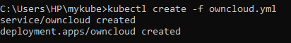

## - Now run the kubectl get all command to get all the services that are running

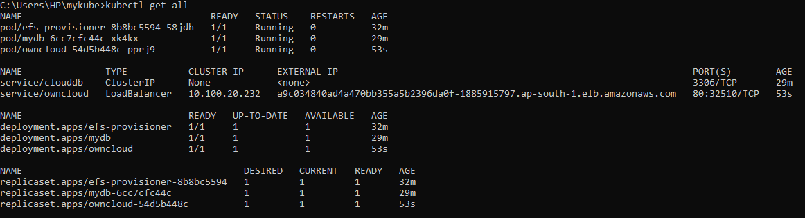

## - For the Final output, Copy the EXTERNAL-IP of ownloud and open in any web browser

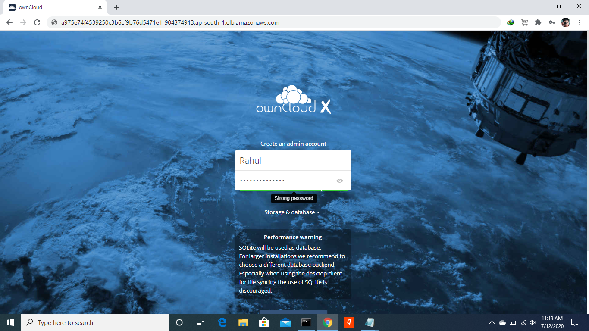

## - For deleting the whole cluster

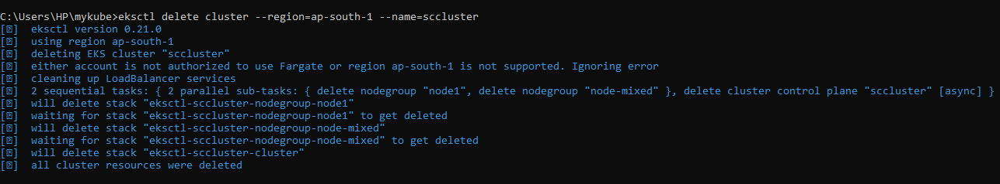


## Created By:-
[Rahul Mahawar](https://www.linkedin.com/in/rahul-mahawar-448333194/)

